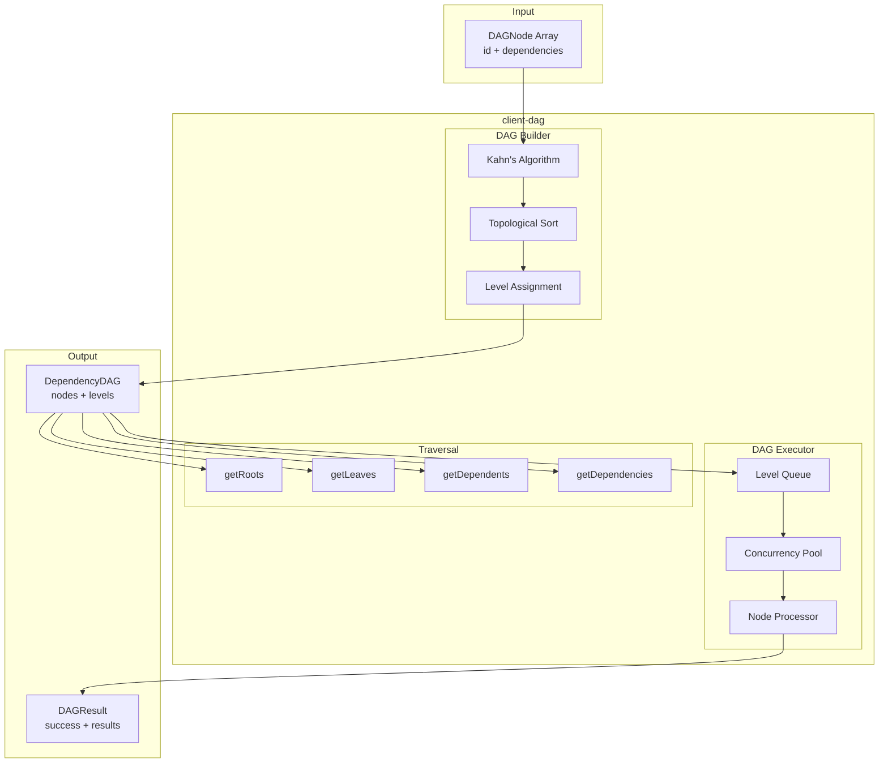
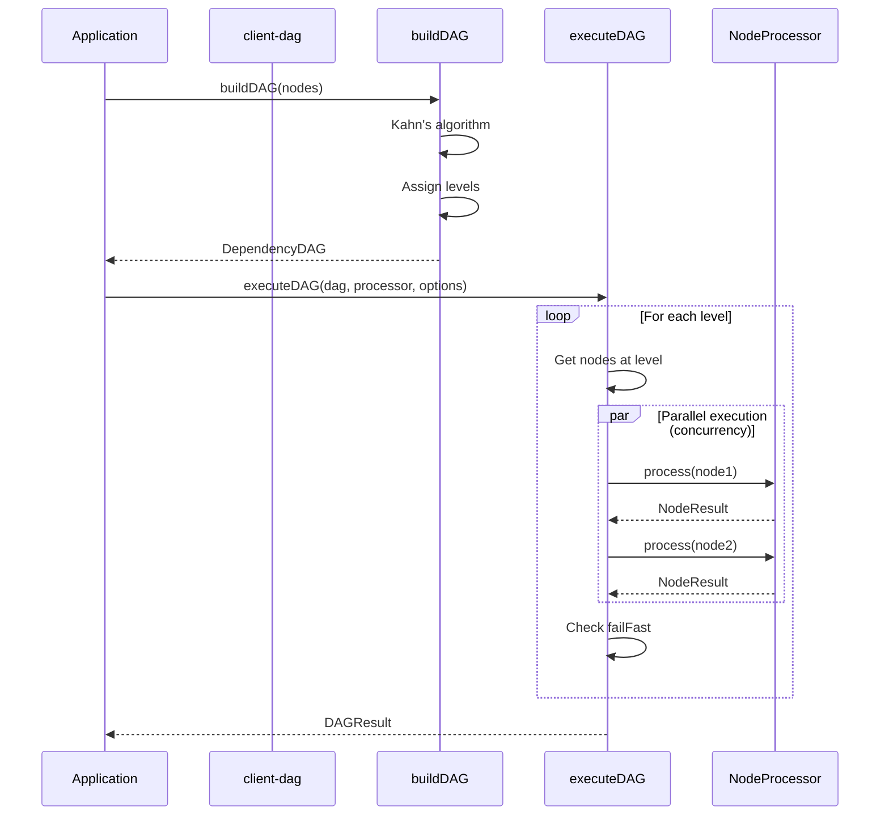
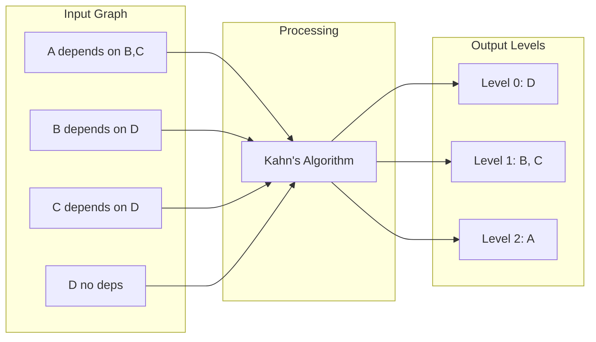
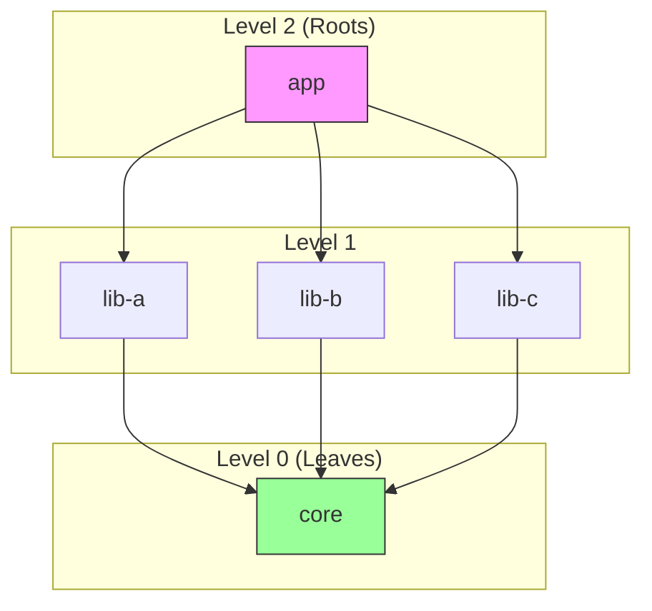
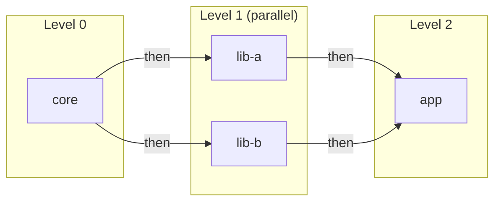
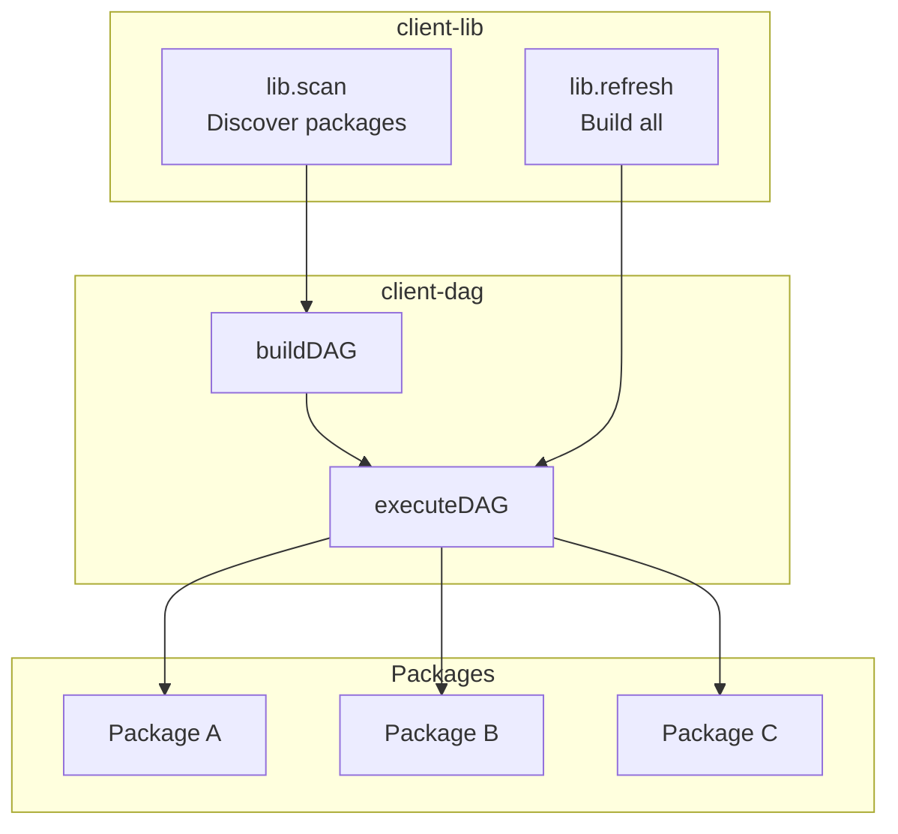

# @mark1russell7/client-dag

[](https://opensource.org/licenses/MIT)
[](https://www.typescriptlang.org/)
[](https://nodejs.org/)

> Generic DAG (Directed Acyclic Graph) utilities for dependency ordering and parallel execution. Powers the ecosystem's build system.

## Table of Contents

- [Overview](#overview)
- [Installation](#installation)
- [Architecture](#architecture)
- [Quick Start](#quick-start)
- [API Reference](#api-reference)
  - [Types](#types)
  - [Functions](#functions)
  - [buildDAG](#builddag)
  - [executeDAG](#executedag)
- [Use Cases](#use-cases)
- [Integration](#integration)
- [Requirements](#requirements)
- [License](#license)

---

## Overview

**client-dag** provides utilities for working with Directed Acyclic Graphs:

- **DAG Building** - Topological sorting using Kahn's algorithm
- **Parallel Execution** - Process nodes level-by-level with configurable concurrency
- **Traversal Utilities** - Find roots, leaves, dependents, and dependencies
- **Progress Tracking** - Callbacks for node start/complete events

---

## Installation

```bash
npm install github:mark1russell7/client-dag#main
```

---

## Architecture

### System Overview



### Execution Flow



### Topological Sorting (Kahn's Algorithm)



### DAG Structure Visualization



---

## Quick Start

```typescript
import {
  buildDAG,
  executeDAG,
  type DAGNode,
  type NodeProcessor,
} from "@mark1russell7/client-dag";

// Define nodes
const nodes: DAGNode[] = [
  { id: "app", dependencies: ["lib-a", "lib-b"] },
  { id: "lib-a", dependencies: ["core"] },
  { id: "lib-b", dependencies: ["core"] },
  { id: "core", dependencies: [] },
];

// Build the DAG
const dag = buildDAG(nodes);
// Levels: [["core"], ["lib-a", "lib-b"], ["app"]]

// Define a processor
const processor: NodeProcessor = async (node) => {
  console.log(`Processing ${node.id}`);
  // Do work...
  return {
    node,
    success: true,
    duration: 100,
    logs: [`Built ${node.id}`],
  };
};

// Execute with parallel processing per level
const result = await executeDAG(dag, processor, {
  concurrency: 4,
  failFast: true,
  onNodeStart: (node) => console.log(`Starting: ${node.id}`),
  onNodeComplete: (result) => console.log(`Done: ${result.node.id}`),
});
```

---

## API Reference

### Types

```typescript
interface DAGNode<TData = unknown> {
  id: string;                    // Unique identifier
  dependencies: string[];        // IDs of dependencies
  level?: number;                // Topological level (computed)
  data?: TData;                  // Optional user data
}

interface DependencyDAG<TNode extends DAGNode = DAGNode> {
  nodes: Map<string, TNode>;     // All nodes
  levels: TNode[][];             // Nodes by level
  roots: string[];               // No dependents (end nodes)
  leaves: string[];              // No dependencies (start nodes)
}

interface DAGExecutionOptions<TNode extends DAGNode = DAGNode> {
  concurrency?: number;          // Max parallel per level (default: 4)
  failFast?: boolean;            // Stop on first error (default: true)
  onNodeStart?: (node: TNode) => void;
  onNodeComplete?: (result: NodeResult<TNode>) => void;
}

interface NodeResult<TNode extends DAGNode = DAGNode> {
  node: TNode;
  success: boolean;
  error?: Error;
  duration: number;              // ms
  logs: string[];
  output?: unknown;
}

interface DAGResult<TNode extends DAGNode = DAGNode> {
  success: boolean;
  results: Map<string, NodeResult<TNode>>;
  failedNodes: string[];
  totalDuration: number;
}

type NodeProcessor<TNode extends DAGNode = DAGNode> = (
  node: TNode
) => Promise<NodeResult<TNode>>;
```

### Functions

| Function | Description |
|----------|-------------|
| `buildDAG(nodes)` | Build a DAG from nodes with dependencies |
| `executeDAG(dag, processor, options)` | Execute DAG with parallel processing |
| `getRoots(dag)` | Get nodes with no dependents |
| `getLeaves(dag)` | Get nodes with no dependencies |
| `getDependents(dag, id)` | Get nodes that depend on this node |
| `getDependencies(dag, id)` | Get this node's dependencies |

---

### buildDAG

Build a leveled DAG using Kahn's algorithm.

```typescript
import { buildDAG } from "@mark1russell7/client-dag";

const nodes = [
  { id: "a", dependencies: ["b", "c"] },
  { id: "b", dependencies: ["d"] },
  { id: "c", dependencies: ["d"] },
  { id: "d", dependencies: [] },
];

const dag = buildDAG(nodes);
// dag.levels = [
//   [{ id: "d", ... }],      // Level 0: process first
//   [{ id: "b" }, { id: "c" }], // Level 1: parallel
//   [{ id: "a", ... }],      // Level 2: process last
// ]
```

**Cycle Detection:**
```typescript
// Throws if cycles detected
const cyclic = [
  { id: "a", dependencies: ["b"] },
  { id: "b", dependencies: ["a"] }, // Cycle!
];
buildDAG(cyclic); // Error: Cycle detected
```

---

### executeDAG

Execute nodes level by level with configurable parallelism.

```typescript
import { executeDAG } from "@mark1russell7/client-dag";

const result = await executeDAG(dag, processor, {
  concurrency: 4,        // Process up to 4 nodes in parallel per level
  failFast: true,        // Stop immediately on first failure
  onNodeStart: (node) => console.log(`Starting: ${node.id}`),
  onNodeComplete: (r) => console.log(`${r.node.id}: ${r.success ? "OK" : "FAIL"}`),
});

if (result.success) {
  console.log("All nodes processed successfully");
} else {
  console.log("Failed nodes:", result.failedNodes);
}
```

**Execution Order:**



---

## Use Cases

### Package Build Order

Build packages in dependency order (used by `lib.refresh`):

```typescript
const packages = [
  { id: "app", dependencies: ["@org/lib-ui", "@org/lib-core"] },
  { id: "@org/lib-ui", dependencies: ["@org/lib-core"] },
  { id: "@org/lib-core", dependencies: [] },
];

const dag = buildDAG(packages);
await executeDAG(dag, async (pkg) => {
  await runBuild(pkg.id);
  return { node: pkg, success: true, duration: 0, logs: [] };
});
```

### Task Scheduling

Execute dependent tasks:

```typescript
const tasks = [
  { id: "deploy", dependencies: ["test", "build"] },
  { id: "test", dependencies: ["build"] },
  { id: "build", dependencies: [] },
];

const dag = buildDAG(tasks);
await executeDAG(dag, async (task) => {
  await runTask(task.id);
  return { node: task, success: true, duration: 0, logs: [] };
});
```

### Module Loading

Load modules respecting dependencies:

```typescript
const modules = [
  { id: "app", dependencies: ["router", "store"] },
  { id: "router", dependencies: ["utils"] },
  { id: "store", dependencies: ["utils"] },
  { id: "utils", dependencies: [] },
];

const dag = buildDAG(modules);
await executeDAG(dag, async (mod) => {
  await import(mod.id);
  return { node: mod, success: true, duration: 0, logs: [] };
});
```

---

## Integration

### With client-lib

`client-lib` uses `client-dag` for ecosystem package management:



### dag.traverse Procedure

The `dag.traverse` procedure in `client-lib` wraps this functionality:

```typescript
// Via procedure
await client.call(["dag", "traverse"], {
  visit: ["pnpm", "install"],
  concurrency: 4,
});

// Internally uses
const dag = buildDAG(packages);
await executeDAG(dag, processor);
```

---

## Requirements

- **Node.js** >= 20
- **Dependencies:**
  - `@mark1russell7/client`

---

## License

MIT
