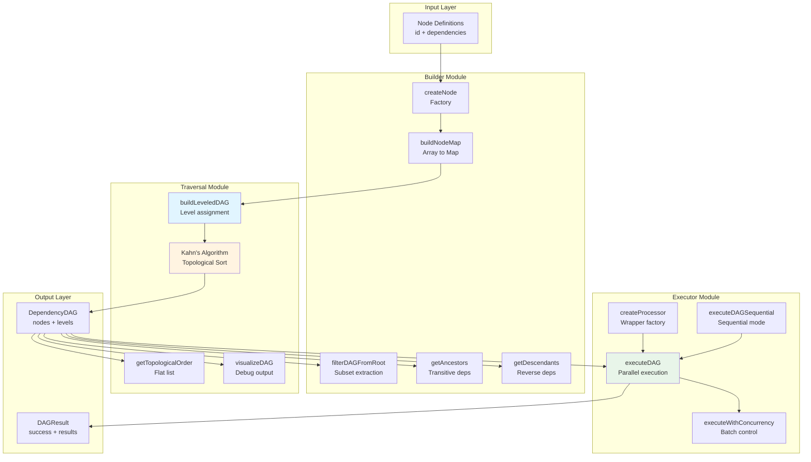
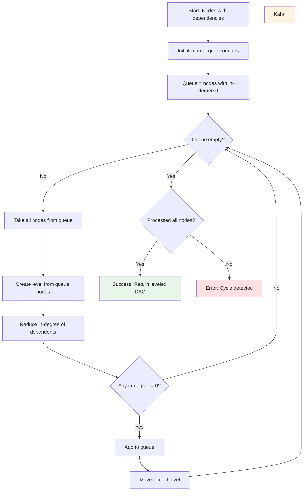
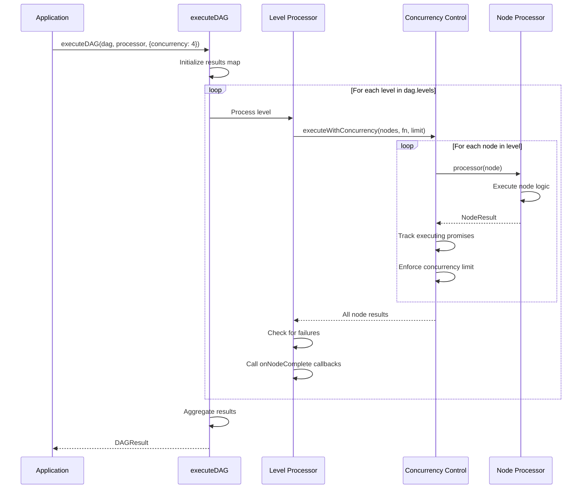
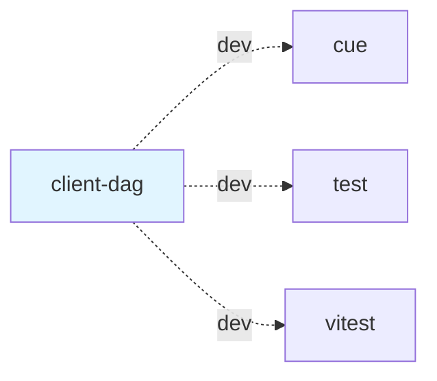

# @mark1russell7/client-dag

[](https://www.npmjs.com/package/@mark1russell7/client-dag)
[](https://opensource.org/licenses/MIT)

Generic DAG (Directed Acyclic Graph) algorithms for dependency management, topological sorting, and parallel execution.

## Overview

`client-dag` provides a robust, generic DAG implementation using Kahn's algorithm for topological sorting. It enables dependency-aware parallel execution with concurrency control, making it ideal for package build systems, task scheduling, and any scenario requiring ordered execution of dependent operations.

### Key Features

- **Kahn's Algorithm**: Topological sort with cycle detection
- **Level Assignment**: Automatic grouping for parallel execution
- **Parallel Execution**: Configurable concurrency per level
- **Generic Types**: Type-safe with custom node data
- **Graph Utilities**: Filter, traverse, and analyze dependencies
- **Fail-Fast or Continue**: Flexible error handling
- **Progress Tracking**: Callbacks for monitoring
- **Visualization**: Helper functions for debugging

## Installation

```bash
npm install @mark1russell7/client-dag
```

### Dependencies

- No runtime dependencies (pure TypeScript/JavaScript)
- Dev: `@mark1russell7/cue`, `vitest`, `@mark1russell7/test`

## Architecture



### Kahn's Algorithm Flow



### Execution Flow



## Usage

### Basic DAG Creation

```typescript
import {
  createNode,
  buildNodeMap,
  buildLeveledDAG,
  type DAGNode
} from "@mark1russell7/client-dag";

// Method 1: Manual node creation
const nodes: DAGNode[] = [
  { id: "app", dependencies: ["lib-a", "lib-b"] },
  { id: "lib-a", dependencies: ["core"] },
  { id: "lib-b", dependencies: ["core"] },
  { id: "core", dependencies: [] }
];

// Method 2: Using factories
const nodesAlt = [
  createNode("app", ["lib-a", "lib-b"]),
  createNode("lib-a", ["core"]),
  createNode("lib-b", ["core"]),
  createNode("core")
];

// Convert to Map
const nodeMap = buildNodeMap(nodes);

// Build leveled DAG
const dag = buildLeveledDAG(nodeMap);

console.log(dag.levels);
// [
//   [{ id: "core", level: 0, ... }],           // Level 0: no dependencies
//   [{ id: "lib-a", level: 1 }, { id: "lib-b", level: 1 }],  // Level 1
//   [{ id: "app", level: 2, ... }]             // Level 2: depends on all
// ]
```

### Parallel Execution

```typescript
import { executeDAG, createProcessor } from "@mark1russell7/client-dag";

// Simple processor
const processor = createProcessor(async (node) => {
  console.log(`Building ${node.id}...`);
  await build(node.id);
});

// Execute with parallelism
const result = await executeDAG(dag, processor, {
  concurrency: 4,  // Up to 4 nodes in parallel per level
  failFast: true,  // Stop on first error
  onNodeStart: (node) => console.log(`Started: ${node.id}`),
  onNodeComplete: (result) => {
    if (result.success) {
      console.log(`Completed: ${result.node.id} (${result.duration}ms)`);
    } else {
      console.error(`Failed: ${result.node.id}`, result.error);
    }
  }
});

if (!result.success) {
  console.error("Failed nodes:", result.failedNodes);
  process.exit(1);
}
```

### Custom Node Data

```typescript
interface PackageNode extends DAGNode {
  data: {
    path: string;
    version: string;
    scripts: Record<string, string>;
  };
}

const packageNodes: PackageNode[] = [
  {
    id: "@org/app",
    dependencies: ["@org/ui"],
    data: {
      path: "/packages/app",
      version: "1.0.0",
      scripts: { build: "tsc" }
    }
  },
  {
    id: "@org/ui",
    dependencies: [],
    data: {
      path: "/packages/ui",
      version: "2.0.0",
      scripts: { build: "vite build" }
    }
  }
];

const dag = buildLeveledDAG(buildNodeMap(packageNodes));

const processor = createProcessor(async (node: PackageNode) => {
  console.log(`Building ${node.id} at ${node.data.path}`);
  await execSync(node.data.scripts.build, { cwd: node.data.path });
});

await executeDAG(dag, processor);
```

### Graph Filtering

```typescript
import { filterDAGFromRoot, getAncestors, getDescendants } from "@mark1russell7/client-dag";

// Filter to only nodes needed for a specific target
const appOnlyNodes = filterDAGFromRoot(nodeMap, "app");
const appDAG = buildLeveledDAG(appOnlyNodes);

// Get all dependencies of a node (transitive)
const appDeps = getAncestors(nodeMap, "app");
console.log(appDeps); // Set { "lib-a", "lib-b", "core" }

// Get all dependents of a node (reverse dependencies)
const coreDependents = getDescendants(nodeMap, "core");
console.log(coreDependents); // Set { "lib-a", "lib-b", "app" }
```

### Visualization

```typescript
import { visualizeDAG } from "@mark1russell7/client-dag";

const output = visualizeDAG(dag);
console.log(output);
// DAG Structure:
//   Level 0:
//     - core (leaf)
//   Level 1:
//     - lib-a -> [core]
//     - lib-b -> [core]
//   Level 2:
//     - app -> [lib-a, lib-b]
```

### Sequential Execution

```typescript
import { executeDAGSequential } from "@mark1russell7/client-dag";

// Execute one node at a time (concurrency: 1)
const result = await executeDAGSequential(dag, processor, {
  failFast: false  // Continue even if some nodes fail
});
```

## API Reference

### Types

#### `DAGNode<TData = unknown>`

```typescript
interface DAGNode<TData = unknown> {
  id: string;                    // Unique identifier
  dependencies: string[];        // IDs this node depends on
  level?: number;                // Topological level (computed by buildLeveledDAG)
  data?: TData | undefined;      // Optional user data
}
```

#### `DependencyDAG<TNode extends DAGNode = DAGNode>`

```typescript
interface DependencyDAG<TNode extends DAGNode = DAGNode> {
  nodes: Map<string, TNode>;     // All nodes by ID
  levels: TNode[][];             // Nodes grouped by level (0 = leaves)
  roots: string[];               // Node IDs with no dependents
  leaves: string[];              // Node IDs with no dependencies
}
```

#### `DAGExecutionOptions<TNode extends DAGNode = DAGNode>`

```typescript
interface DAGExecutionOptions<TNode extends DAGNode = DAGNode> {
  concurrency?: number;                      // Max parallel per level (default: 4)
  failFast?: boolean;                        // Stop on first error (default: true)
  onNodeStart?: (node: TNode) => void;       // Called when node starts
  onNodeComplete?: (result: NodeResult<TNode>) => void;  // Called when node completes
}
```

#### `NodeResult<TNode extends DAGNode = DAGNode>`

```typescript
interface NodeResult<TNode extends DAGNode = DAGNode> {
  node: TNode;                   // The processed node
  success: boolean;              // Whether processing succeeded
  error?: Error | undefined;     // Error if failed
  duration: number;              // Processing time in milliseconds
  logs: string[];                // Log messages
  output?: unknown | undefined;  // Optional output data
}
```

#### `DAGResult<TNode extends DAGNode = DAGNode>`

```typescript
interface DAGResult<TNode extends DAGNode = DAGNode> {
  success: boolean;                         // Overall success
  results: Map<string, NodeResult<TNode>>;  // Results by node ID
  failedNodes: string[];                    // IDs of failed nodes
  totalDuration: number;                    // Total execution time in ms
}
```

#### `NodeProcessor<TNode extends DAGNode = DAGNode>`

```typescript
type NodeProcessor<TNode extends DAGNode = DAGNode> = (
  node: TNode
) => Promise<NodeResult<TNode>>;
```

### Functions

#### Building

##### `createNode<TData>(id: string, dependencies?: string[], data?: TData): DAGNode<TData>`

Create a DAG node from minimal input.

```typescript
const node = createNode("my-package", ["dep-a", "dep-b"], {
  path: "/packages/my-package"
});
```

##### `buildNodeMap<TNode extends DAGNode>(nodes: TNode[]): Map<string, TNode>`

Convert an array of nodes to a Map keyed by ID.

```typescript
const nodeMap = buildNodeMap([
  createNode("a", ["b"]),
  createNode("b", [])
]);
```

#### Traversal

##### `buildLeveledDAG<TNode extends DAGNode>(nodes: Map<string, TNode>): DependencyDAG<TNode>`

Build a leveled DAG using Kahn's algorithm. Assigns level to each node and groups by level.

**Throws:** Error if a cycle is detected.

```typescript
const dag = buildLeveledDAG(nodeMap);
console.log(dag.levels.length);  // Number of levels
```

##### `getTopologicalOrder<TNode extends DAGNode>(dag: DependencyDAG<TNode>): TNode[]`

Get a flat array of nodes in topological order (leaves first).

```typescript
const order = getTopologicalOrder(dag);
// [core, lib-a, lib-b, app]
```

##### `visualizeDAG<TNode extends DAGNode>(dag: DependencyDAG<TNode>): string`

Generate a string visualization of the DAG structure.

```typescript
console.log(visualizeDAG(dag));
```

#### Filtering

##### `filterDAGFromRoot<TNode extends DAGNode>(nodes: Map<string, TNode>, rootId: string): Map<string, TNode>`

Filter DAG to only include nodes reachable from a root (the root and all its dependencies).

```typescript
const appOnly = filterDAGFromRoot(allNodes, "app");
```

##### `getAncestors<TNode extends DAGNode>(nodes: Map<string, TNode>, id: string): Set<string>`

Get all ancestors of a node (transitive dependencies).

```typescript
const deps = getAncestors(nodes, "app");
// Set of all nodes that "app" depends on
```

##### `getDescendants<TNode extends DAGNode>(nodes: Map<string, TNode>, id: string): Set<string>`

Get all descendants of a node (reverse transitive dependencies).

```typescript
const dependents = getDescendants(nodes, "core");
// Set of all nodes that depend on "core"
```

#### Execution

##### `executeDAG<TNode extends DAGNode>(dag: DependencyDAG<TNode>, processor: NodeProcessor<TNode>, options?: DAGExecutionOptions<TNode>): Promise<DAGResult<TNode>>`

Execute DAG with level-based parallelization.

- Levels are processed sequentially (level 0, then 1, etc.)
- Within each level, nodes are processed in parallel up to concurrency limit
- Returns aggregated results

```typescript
const result = await executeDAG(dag, processor, {
  concurrency: 4,
  failFast: true,
  onNodeStart: (node) => console.log(`Starting ${node.id}`),
  onNodeComplete: (result) => console.log(`Done ${result.node.id}`)
});
```

##### `executeDAGSequential<TNode extends DAGNode>(dag: DependencyDAG<TNode>, processor: NodeProcessor<TNode>, options?: Omit<DAGExecutionOptions<TNode>, 'concurrency'>): Promise<DAGResult<TNode>>`

Execute DAG sequentially (concurrency: 1).

```typescript
const result = await executeDAGSequential(dag, processor);
```

##### `createProcessor<TNode extends DAGNode>(fn: (node: TNode) => Promise<void>): NodeProcessor<TNode>`

Create a processor that wraps an async function, handling timing and error catching.

```typescript
const processor = createProcessor(async (node) => {
  await buildPackage(node.id);
});
```

## Examples

### Example 1: Monorepo Package Build

```typescript
import { buildLeveledDAG, executeDAG, createProcessor } from "@mark1russell7/client-dag";

const packages = [
  { id: "app", dependencies: ["ui", "api-client"] },
  { id: "ui", dependencies: ["components", "utils"] },
  { id: "api-client", dependencies: ["utils"] },
  { id: "components", dependencies: ["utils"] },
  { id: "utils", dependencies: [] }
];

const dag = buildLeveledDAG(buildNodeMap(packages));

const processor = createProcessor(async (pkg) => {
  console.log(`Building ${pkg.id}...`);
  await exec(`npm run build`, { cwd: `/packages/${pkg.id}` });
});

const result = await executeDAG(dag, processor, {
  concurrency: 3,
  onNodeComplete: (r) => {
    if (r.success) {
      console.log(`✓ ${r.node.id} built in ${r.duration}ms`);
    }
  }
});
```

### Example 2: Task Pipeline

```typescript
const tasks = [
  { id: "deploy", dependencies: ["test", "build-docker"] },
  { id: "test", dependencies: ["build"] },
  { id: "build-docker", dependencies: ["build"] },
  { id: "build", dependencies: ["lint", "typecheck"] },
  { id: "lint", dependencies: [] },
  { id: "typecheck", dependencies: [] }
];

const dag = buildLeveledDAG(buildNodeMap(tasks));

const processor = createProcessor(async (task) => {
  await runTask(task.id);
});

await executeDAG(dag, processor, { failFast: true });
```

### Example 3: Selective Execution

```typescript
// Only build what's needed for "app"
const allPackages = buildNodeMap([...]);
const appDeps = filterDAGFromRoot(allPackages, "app");
const appDAG = buildLeveledDAG(appDeps);

await executeDAG(appDAG, buildProcessor);
```

### Example 4: Progress Tracking

```typescript
let completed = 0;
const total = dag.nodes.size;

const result = await executeDAG(dag, processor, {
  onNodeComplete: (result) => {
    completed++;
    const percent = ((completed / total) * 100).toFixed(1);
    console.log(`[${percent}%] ${result.node.id}: ${result.success ? 'OK' : 'FAIL'}`);
  }
});
```

### Example 5: Continue on Error

```typescript
const result = await executeDAG(dag, processor, {
  failFast: false  // Process all nodes even if some fail
});

if (!result.success) {
  console.error("Failed nodes:", result.failedNodes.join(", "));
  for (const id of result.failedNodes) {
    const nodeResult = result.results.get(id);
    console.error(`${id}: ${nodeResult?.error?.message}`);
  }
}
```

## Cycle Detection

If a cycle is detected, `buildLeveledDAG` throws an error:

```typescript
const nodes = [
  { id: "a", dependencies: ["b"] },
  { id: "b", dependencies: ["c"] },
  { id: "c", dependencies: ["a"] }  // Cycle!
];

try {
  const dag = buildLeveledDAG(buildNodeMap(nodes));
} catch (error) {
  console.error(error.message);
  // "Circular dependency detected involving: a, b, c"
}
```

## Performance

### Complexity

- **buildLeveledDAG**: O(V + E) where V = vertices, E = edges
- **executeDAG**: O(V * T) where T = average task time
- **getAncestors/getDescendants**: O(V + E) per call

### Optimization Tips

1. **Concurrency**: Tune based on CPU cores and I/O characteristics
2. **Fail-Fast**: Enable for faster feedback in CI/CD
3. **Level Inspection**: Use `dag.levels` to understand parallelism opportunities
4. **Node Filtering**: Use `filterDAGFromRoot` to reduce work

## Testing

The package includes comprehensive tests:

```bash
npm test
npm run test:watch
npm run test:coverage
```

Test files:
- `src/dag/__tests__/builder.test.ts` - Graph building and filtering
- `src/dag/__tests__/traversal.test.ts` - Kahn's algorithm and topological sort
- `src/dag/__tests__/executor.test.ts` - Parallel execution and concurrency

## Package Structure

```
client-dag/
├── src/
│   ├── index.ts              # Main exports
│   ├── types.ts              # TypeScript type definitions
│   └── dag/
│       ├── index.ts          # DAG module exports
│       ├── builder.ts        # Graph building utilities
│       ├── traversal.ts      # Kahn's algorithm + topological sort
│       ├── executor.ts       # Parallel execution engine
│       └── __tests__/        # Test suite
├── dist/                     # Compiled output
├── package.json
├── tsconfig.json
└── README.md
```

## Development

### Build

```bash
npm run build
```

### Type Check

```bash
npm run typecheck
```

### Clean

```bash
npm run clean
```

### Run Tests

```bash
npm test
npm run test:watch
npm run test:coverage
```

## Integration with Ecosystem

### Used By

- **client-lib**: Package dependency resolution
- **CLI**: Build orchestration commands
- **CI/CD**: Multi-package pipelines

### Dependency Graph



## License

MIT - Mark Russell

## Related Packages

- `@mark1russell7/client-lib` - Uses DAG for package builds
- `@mark1russell7/test` - Testing utilities
- `@mark1russell7/cue` - Build configuration
